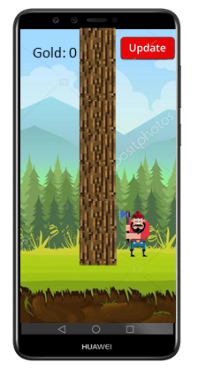
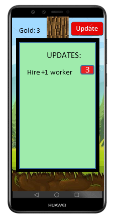

## Functional design
`Lumberjack Simulator` is a simulator game, where the timber man chops down one single tree all the time and earns from it money.
By earning gold our timber man will be able to increase his axe, chop power and to buy new trees and workers.
His goal is to earn as much gold as he can to climb one day on the tree to defeat the boss.

### Main Screen

This is the main screen, which opens after launching the game.

- In top-left corner user can see the gold his timber man earned.
- Tap the tree cause timber man to chop.
- Tap the "Update" button to see possible updates (see "Update Screen").

### Update Screen

This is update screen, where user can spend some earned money on new items or upgrade previous ones.

- Tap on the price near the item to buy it.
- Tap outside the Update view to get back to Main Screen.